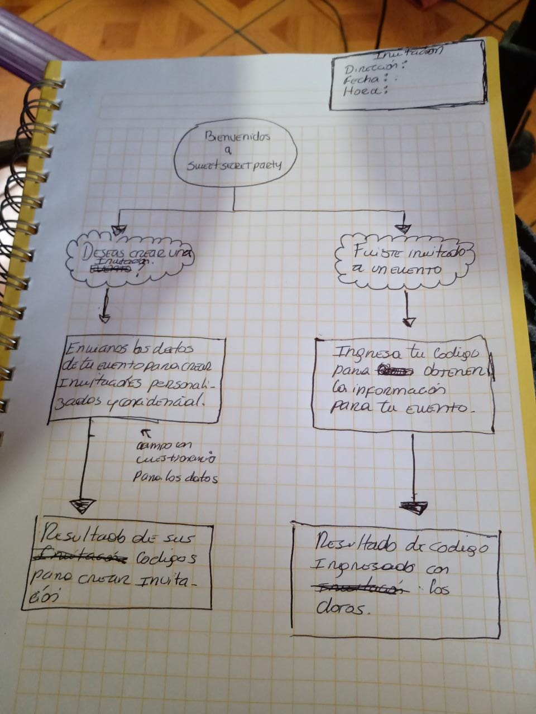
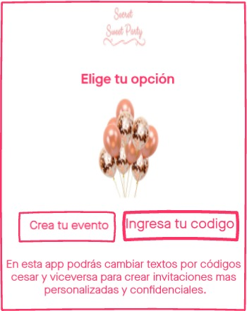
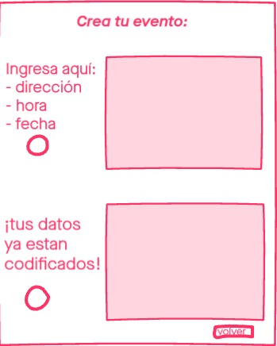
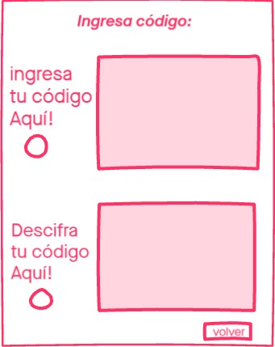

# Cifrado Cesar:
Sweet Secret Party:

Sweet Secret Party es una aplicación web y su función principal es convertir textos a cifrado cesar y cifrado cesar a texto. 

Pero ¿Qué es cifrado Cesar?
Es una de las técnicas más simples para cifrar un mensaje y que consiste en que cada letra del texto original es reemplazada por otra que se encuentra en un número fijo de posiciones (desplazamiento) más adelante en el mismo alfabeto, y en esta app nuestros usuarios podrán elegir la cantidad de desplazamientos que desees.
Esta app se encargará de codificar y decodificar tus textos especialmente para cuando organices una fiesta para que cada dato de ella este codificado y llegue a las personas que correspondan.
Para hacerlo debes ingresar al siguiente link y descargar el archivo:https://mariajosegarrido.github.io/SCL013-cipher/src/index.html
 
## Como usar esta App: 
Ingresas la información en la casilla que dice "Escribe tu información aquí", le das click a "codificar" y te dará tus datos en código.

## A quienes va dirigida nuestra App y quienes son los principales usuarios:
Esta App web va dirigido a todo tipo de público especialmente a aquellos que deseen hacer de algún texto algo mucho más privado y confidencial como lo serian en el caso de hacer fiestas, citas o sorpresas secretas.

## El objetivo de los usuarios en relación con el servicio:
El objetivo de nuestros usuarios en relación con nuestro servicio será mantener en completa confidencialidad la organización de sus eventos para así hacer llegar las invitaciones (textos) solo a las personas que correspondan; ya que como conocemos muchos de los eventos creados de otras maneras no son 100% confidenciales muchas veces el mensaje o la invitación llega a manos equivocadas.

## ¿Cómo nuestro Servicio resuelve los problemas de los usuarios?
Este servicio resuelve el problema de los usuarios de una manera fácil, rápida y divertida; ya que al cambiar los textos a códigos y los códigos a texto hace que la experiencia de la invitación sea más didáctica e interactiva; de esta manera si el mensaje llega a manos equivocadas evita que este sea entendido de una manera, de hecho, evitaría que personas ajenas al evento o cita comprendan su significado quedando de esta manera el evento en completa confidencialidad.

### Prototipado en papel

### Prototipado invision

## FeedBack
Según el testeo de la app web se llegó a la conclusión que era mejor dejar solo una página funcional, donde se explicara como funciona la web y como puede interactuar el usuario con nuestra plataforma en el mismo lugar.